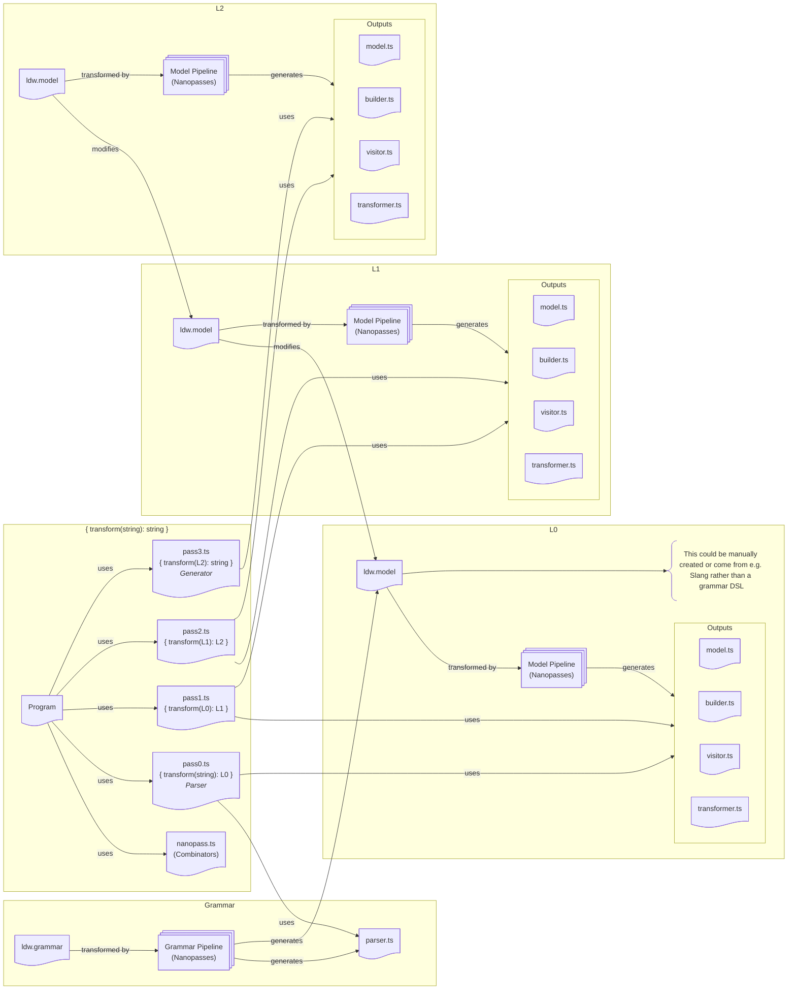

# Models

The following diagram shows an example structure involving a 4 pass
transformation. In fact, this is the exact structure used by the Model Pipeline,
which as you can see is recursively defined. There are multiple L4’s in that
case, one for each output. The Grammar Pipeline is defined in exactly the same
meta-circular manner, but with two L4’s - one that outputs the `parser.ts` code
and one that outputs the `ldw.model` defining the output of the parser. Each of
the `.ts` files need to be `.rs` for the Slang nanopasses. The `.ts` outputs
would continue to be used for the Model and Grammar pipelines, recognising that
the Grammar facilities are likely not needed at this stage, because the parser
and `L0` model definition can be manually maintained.

